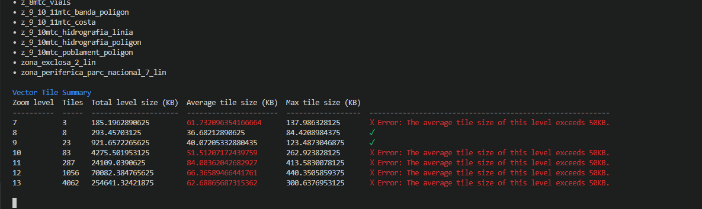
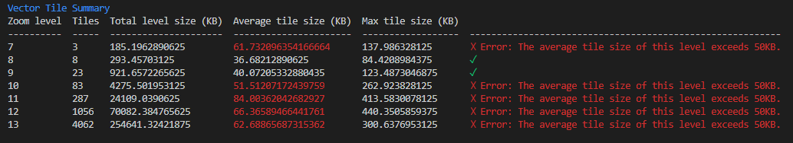
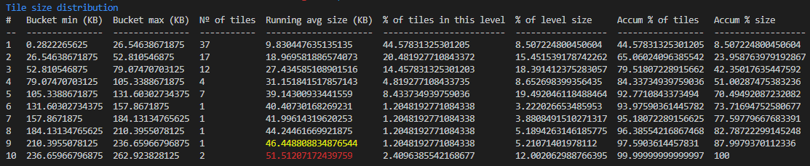
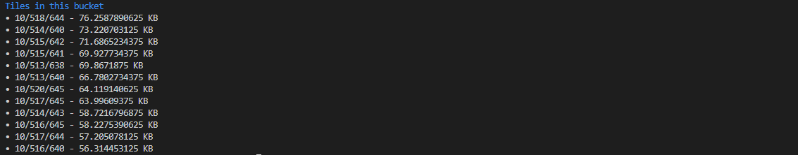
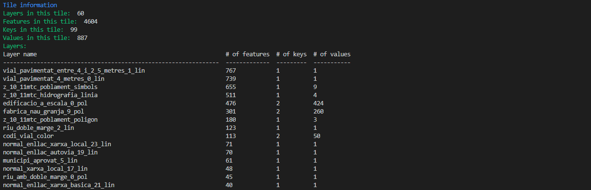
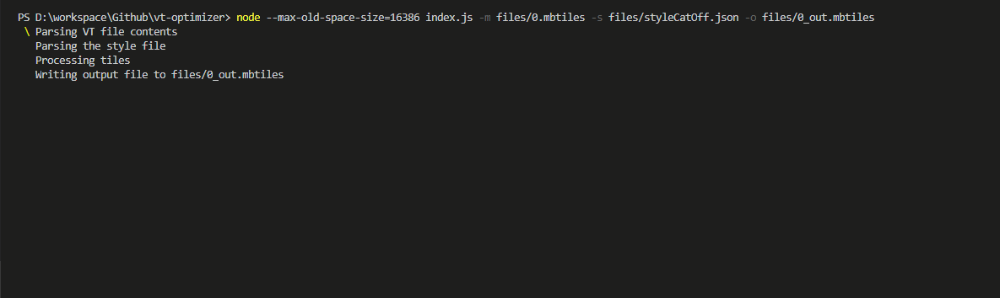
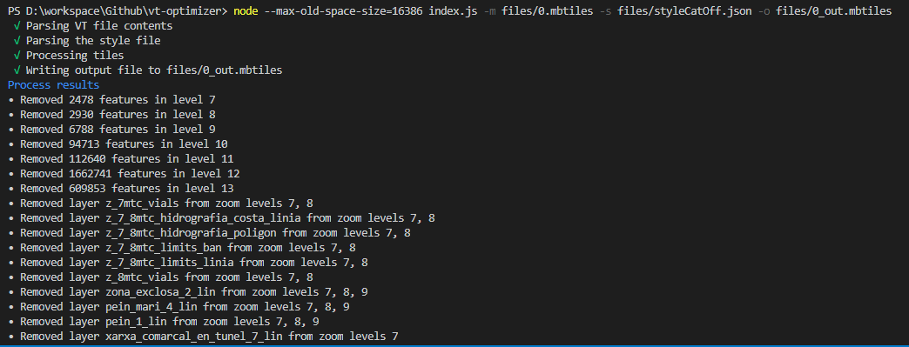

# Vector Tile optimizer

[](https://travis-ci.org/ibesora/vt-optimizer)
> A small NodeJS cli tool to inspect and optimize [Mapbox Vector Tiles](https://www.mapbox.com/vector-tiles/) files



## Installation

Clone this repository and run `npm install`

## Usage
This tool has two main functionalities: **inspecting** a vector tile to see if it conforms to Mapbox's recommendations of an average tile size of 50KB and a maximum tile size of 500KB and **optimizing** a vector tile to be used with a fixed style.

### Vector Tile inspection
When running the tool with the *-m file.mbtiles* argument, the inspection mode will be started. This mode is used for interactively inspecting the contents of a Vector Tile.

After the file is read, some metadata about the file, the layers list and a summary table are shown. With this table you can get a first glimpse of how well your Vector Tile is doing.

Where:
* **Zoom level** is the zoom level index
* **Tiles** is the total number of tiles found in this level
* **Total level size** is the sum of all the data found in this level in kilobytes
* **Average tile size** is the average tile size of the tiles found in this level in kilobytes
* **Max tile size** is the maximum tile size found in this level

We can then get more information about a given level to see the distribution of its tiles by size on a 10-bucket histogram. 

Where:
* **Bucket min** and **Bucket max** are the minimum and maximum size of this bucket respectively
* **Nº of tiles** is the number of tiles that have a size between the min and max values defined by the bucket
* **Running avg size** is the tile average size in kilobytes that this level would have if only the buckets up to and including this one were present. Average sizes that are almost at the limit of the recommendation are drawn in yellow and the ones that go above the limit are drawn in red. If the average size is above limit you'd want, it, ideally, as lower as possible on the list.
* **% of tiles in this level** is the percentage of tiles found in this bucket. Ideally you'd want an almost even distribution of tiles between bucket sizes.
* **% of level size** is the percentage of level size that this bucket brings to the level total
* **Accum % of tiles** is the accumulated percentage number of tiles from the lower size bucket up to the one we are looking at
* **Accum % size** is the accumulated percentage of level size from the lower size bucket up to the one we are looking at

Afterwards we can see which are the specific tiles that fall inside a given bucket

and selecting one of them we can see a summary of the tile contents

where the number of layers and the number of features and properties of each layer are shown. 

### Vector Tile optimization
When running the tool with the *-m file.mbtiles* and *-s style.json* arguments, the optimization mode will be started. This mode is used for optimizing a Vector Tile when used in conjunction with a style that follows [Mapbox Style Specification](https://www.mapbox.com/mapbox-gl-js/style-spec/). 

It reads both the Vector Tile and style and removes all the layers and features that are not visible, either because they are not used or because the style configuration makes them not renderable. When the process is finished the number of features removed in each zoom level and the levels where each layer has been removed from are shown.

**Note:** To use the optimization tool it's better to run the `--max-old-space-size` NodeJS argument to increase NodeJS process heap space as the entire Vector Tile is loaded and decompressed when working.
```
node --max-old-space-size=16386 index.js -m files/input.mbtiles -s files/style.json -o files/output.mbtiles
```